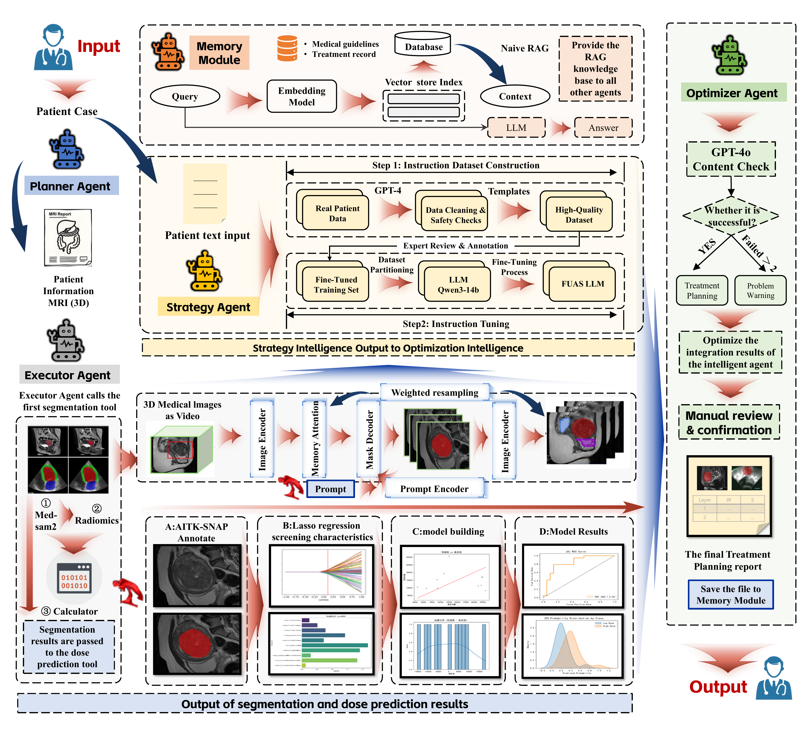
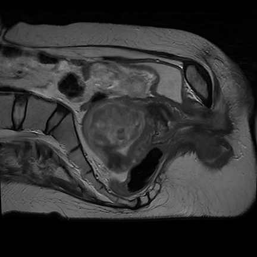
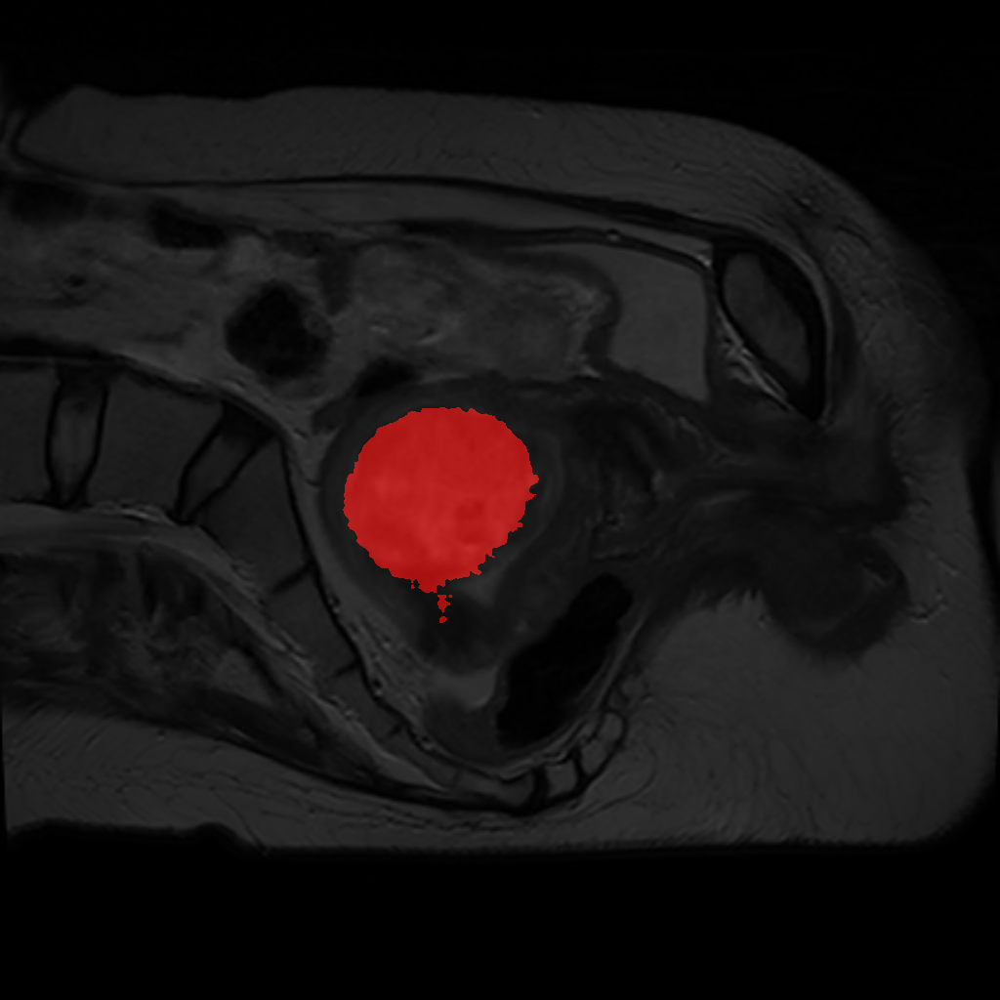

# FUAS-Agents

## **Autonomous Multi-Modal LLM Agents for Focused Ultrasound Ablation Surgery (FUAS) Treatment Planning**

This repository provides the official implementation of **FUAS-Agents**, a multi-agent system for **segmentation**, **treatment strategy generation**, and **dose prediction** in Focused Ultrasound Ablation Surgery (FUAS).  
The framework leverages **multi-modal large language models (MM-LLMs)** to coordinate medical AI tools, achieving personalized, end-to-end treatment planning.

---

## Overview

<p align="center">
  
</p>

**Figure 1. System Overview** – The Planner Agent coordinates three core agents:
* **Segmentation Agent** – performs MRI lesion segmentation using three prompt modes (Auto, Click, BBox).  
* **Strategy Agent** – generates treatment plans from patient profiles and imaging data.  
* **Dose Prediction Agent** – estimates optimal therapeutic dose using radiomics-based ML models.  
The system integrates multimodal understanding, tool calling, and iterative optimization to deliver a complete FUAS treatment proposal.

---

## Key Features
- **End-to-End Workflow**: Input 3D NIfTI (NII) MRI files, convert to 2D slices, segment lesions, visualize results, and repackage into NII format for dose prediction.
- **Planner Agent**: Main entry point (`main.py`) orchestrates segmentation, visualization, and planning via the `planner` function.
- **Flexible Prompting**: Three segmentation prompt modes:
  - **autonomy** – fully automatic
  - **click** – single-point user guidance
  - **bbox** – bounding box guidance
- **Multi-Agent Intelligence**: Three cooperating agents:
  1. **Segmentation Agent** (MedSAM2-based)
  2. **Strategy Agent** (treatment plan generation)
  3. **Dose Prediction Agent** (radiomics + XGBoost)

---

### *there's a demo of our project:*
<p align="center">
  
  
</p>

<p align="center">
Comparison of the <strong>original image</strong> and the <strong>predicted result</strong>.
</p>

---

## Installation

Clone the repository and create the environment:

```bash
git clone https://github.com/JaxnBai/FUAS.git
cd FUAS
conda env create -f environment.yml
conda activate FUAS
````
Download SAM2 checkpoint from checkpoints folder
```
bash checkpoints/download_ckpts.sh
```
Import your API in config.json
```
{
"qwen3_key":"your_api_key_here"
}
```

Ensure you have GPU support for PyTorch/MedSAM2 if running large-scale inference.

---

## Usage

1. **Prepare Input**
   Place your `.nii` MRI files in the dataset directory.

2. **Run the Pipeline**
   Execute the main script with desired prompt type and output folder:

   ```bash
   python code/main.py  -niigz_path ./dataset  -prompt autonomy -seg_model ./seg_model/autonomy_v1.pth -dose_model ./dose_model/dose_model_BayesSearchCV.joblib
   ```

   Available prompt options: `autonomy`, `click`, `bbox`.<br>
   Output is in the data/final directory

4. **Workflow Steps (automated inside `planner`)**

   * Convert NII → 2D slices
   * Perform segmentation to generate masks
   * Visualize and stitch original image + mask
   * Reconstruct processed images back to NII
   * Predict treatment dose
   * Generate full treatment plan (segmentation + dose + strategy)

Outputs (segmentation masks, reconstructed NII, treatment report) will be saved to the specified output directory.

---

## Environment

All dependencies are listed in [environment.yml](environment.yml).
Key components include:

* Python ≥3.10
* PyTorch (GPU recommended)
* MedSAM2
* PyRadiomics
* XGBoost
* Nibabel, SimpleITK for NII handling

---

## Citation

If you use this code or dataset in your research, please cite:

```bibtex
@inproceedings{FUASAgents2025,
  title={Autonomous Multi-Modal LLM Agents for Treatment Planning in Focused Ultrasound Ablation Surgery},
}
```

---

## Acknowledgements

This implementation is based on the paper
*Autonomous Multi-Modal LLM Agents for Treatment Planning in Focused Ultrasound Ablation Surgery *.
We thank the clinical collaborators and FUAS experts for their contributions and evaluation.

---


